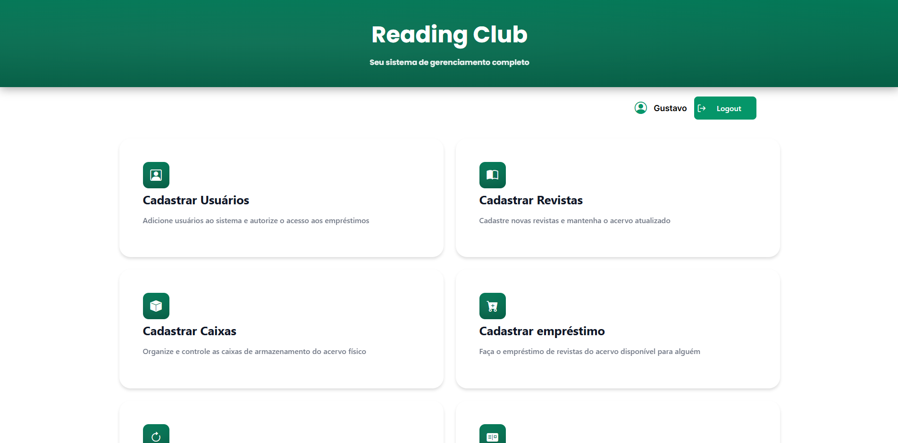
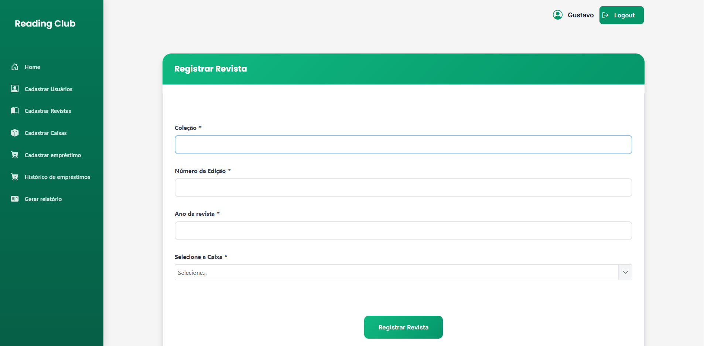

# ReadingClub - Sistema de Empréstimo de Revistas

O **ReadingClub** é uma aplicação web desenvolvida em **Jakarta EE** com o objetivo de gerenciar o empréstimo de revistas em um clube de leitura.  

  

O sistema permite o controle de usuários, revistas, caixas, empréstimos, devoluções e envio automático de notificações por e-mail.

## Funcionalidades

  

### Usuários
- Cadastro de usuários
- Autenticação (login/logout)
- Perfis de acesso:
  - **ADMIN**
  - **USER**
- Ativação de conta por e-mail
- Bloqueio de ações para usuários não ativados

### Caixas
- Cadastro de caixas (organização das revistas)
- Listagem de caixas disponíveis

### Revistas
- Cadastro de revistas
- Controle de disponibilidade
- Listagem geral e apenas revistas disponíveis

### Empréstimos
- Registro de empréstimos
- Definição automática de:
  - Data de retirada
  - Data prevista de devolução
- Restrições:
  - Usuário não pode ter mais de um empréstimo em aberto
  - Revistas emprestadas ficam indisponíveis
- Registro de devolução

### Relatórios
- Empréstimos em andamento
- Empréstimos em atraso
- Empréstimos por usuário (filtro por CPF)

### E-mails Automáticos
- E-mail de ativação de conta
- Notificação automática de empréstimos em atraso

### Agendamento
- Verificação automática diária de empréstimos em atraso
- Envio automático de notificações por e-mail

  

## Regras de Negócio Importantes

Apenas ADMIN pode:
- Cadastrar caixas
- Cadastrar revistas

Usuário só pode:
- Ter um empréstimo ativo

Revistas emprestadas:
- Ficam indisponíveis até devolução

Usuários não ativados:
- Não podem acessar o sistema

## Tecnologias Utilizadas

- **Java 17+**
- **Jakarta EE**
  - CDI
  - JSF
  - JPA
  - Jakarta Mail
- **Hibernate**
- **MySQL / PostgreSQL** (compatível)
- **Maven**
- **Servlet API**
- **ScheduledExecutorService**
- **HTML + CSS (JSF)**

